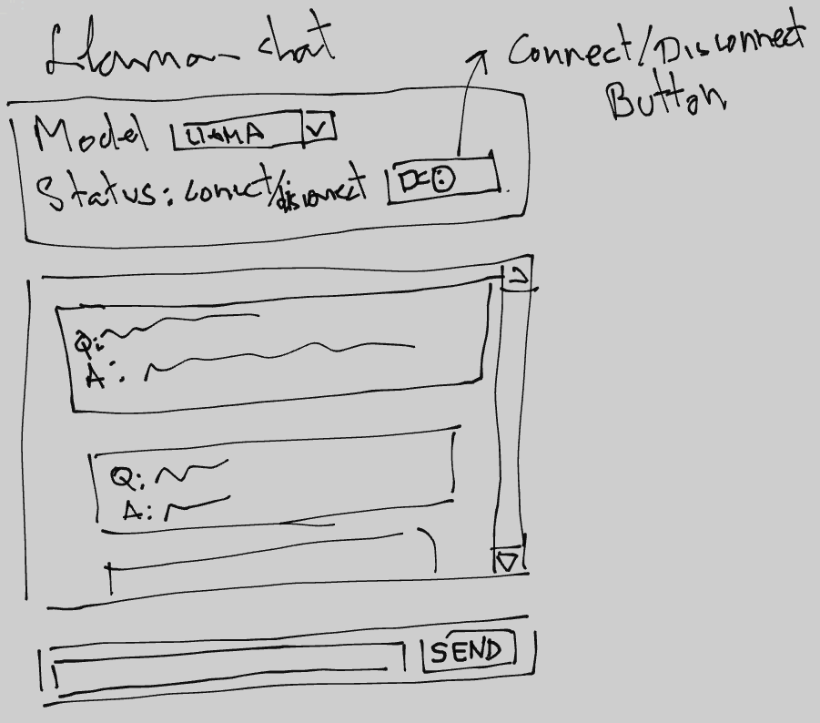

# Simple LLM web chat.

The aim of this project is to test Ollama and do a simple LLM console and web chat using the **ollama-python** library and **FLET**. The console chat, will be actually used to learn how to do things with Ollama, as Ollama itself already has a very good console chat by calling *ollama run model_name* from the terminal.

## Installation.

Read *README.md*.

## Console chat.

The first approximation will be to create a python console chat that will ask for prompt after each new question.

Class client:

```python
import ollama

class ollama_client:
    def __init__(self):
        self.__model = "llama3"
        self.__stream = False

    def ask_question(self, message: str):
        response = ollama.chat(
                model = self.__model,
                messages = [
                        {
                            "role": "user",
                            "content": message,
                        },
                    ],
                stream = self.__stream,
                )
        return response["message"]["content"]
```

Main application:

```python
from llama.client import ollama_client

def main():
    client = ollama_client()

    while True:
        print("Please ask something...")
        message = input("> ")
        print(client.ask_question(message))
        print("")


if __name__ == "__main__":
    main()
```

Console chat:

```console
❯ python main.py
Please ask something...
> Tell me in a few words what you are, please.
I am LLaMA, an AI chatbot trained to understand and respond to human language.

Please ask something...
>
```
## Network console application.

The Ollama python API also allows to use it's REST API. In order to do that the *client.py* must be rewritten as follows:

```python
import ollama

MODELS = ["llama3"]

class ollama_client:
    def __init__(self, model: str, address: str, port: int):
        if model not in MODELS:
            raise Exception(f"The model introduced is invalid. Please select one of the following:\n{MODELS}")
        self.__model = model
        try:
            self.__client = ollama.Client(host=f"{address}:{port}")
        except Exception as error:
            print(f"Connection couldn't be established: {error}.")
            exit(-1)

    def ask_question(self, message: str):
        response = self.__client.chat(model=self.__model, messages=[
                {
                    'role': 'user',
                    'content': message
                }

            ]
        )

        print(response["message"]["content"])
```

In that case, the Ollama **Client** instance is saved in our custom class **ollama_client**. The method **ask_question** is kept from the previous *client.py* shown before.

As the initializer is changed, the *main.py* has also been changed in order to use it in a more comfortable way as a CLI application. Now it can be called from terminal as follows:

```console
python main.py --model llama3 --address 127.0.0.1 --port 11434
```

The python library used is **click**. You can find some information about here (https://click.palletsprojects.com/en/8.1.x/).

The code of the *main.py* application is:

```python
from llama.client import ollama_client

import click

@click.command()
@click.option("--model", required=True, help="Select one compatible model with Ollama. See https://ollama.com/")
@click.option("--address", required=True, help="Address to the server running the model.")
@click.option("--port", required=False, default=11434, help="Communication port with the server.")
def main(model: str, address: str, port: int):
    try:
        client = ollama_client(model=model, address=address, port=port)
    except Exception as error:
        print(f"Ollama client could not be initialized: {error}")

    while True:
        print("Please ask something...")
        message = input("> ")
        print(client.ask_question(message))
        print("")


if __name__ == "__main__":
    main()
```

All this implementation works in local perfectly. But when running from Network there are some problems I don't want to spend my time on. It looks like the connection can not be resolve, or is refused. I think we have to do two steps:

1. Serve Ollama listening from everywhere, as by default only listents the localhost (127.0.0.1). This can be achieved by setting some enviroment variable, or maybe changing some property in some file, and indicating to listen from 0.0.0.0 address.

2. Probably this is not enough and we need to add a rule to the firewall in order to open the port Ollama is using, by default 11434.

## GUI design

For the gui design I'm going to use flet. The schematic design is shown below:


